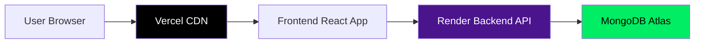
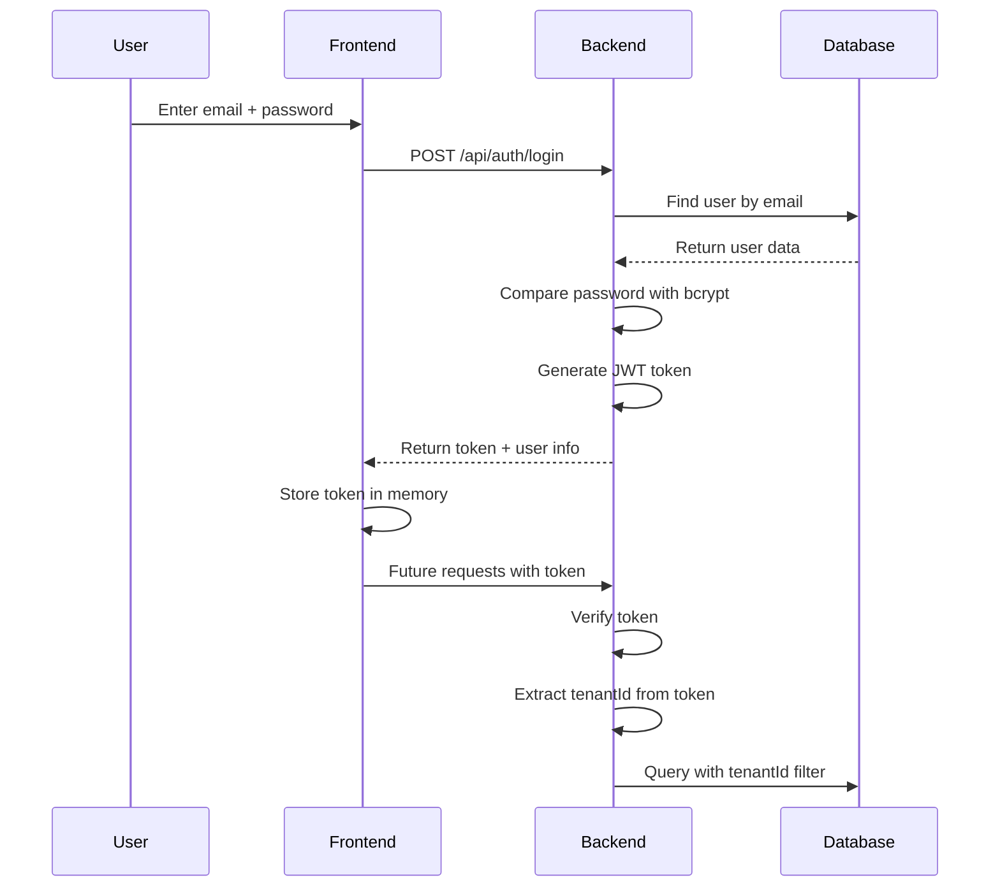

# System Architecture

**Project:** Nexlog  
**Purpose:** Collect, store, and analyze security logs from different sources


---

## 1. System Overview

This system collects security logs (like login attempts, firewall blocks, cloud events) from different places and stores them in one central database. Users can then search these logs, see dashboards with charts, and get alerts when something suspicious happens.

### What the System Does:
1. **Collects logs** from 7 different sources (firewalls, AWS, Microsoft 365, etc.)
2. **Converts logs** into one standard format so we can search them easily
3. **Stores logs** in a database
4. **Shows dashboards** with charts and statistics
5. **Sends alerts** when it detects security problems
6. **Controls access** so each company only sees their own data

---

## 2. System Architecture Diagram


---

## 3. How Data Flows Through the System

### Step 1: Log Collection
Logs come into the system in two ways:

**Method 1: HTTP API** (Real-time)
- Logs are sent directly via HTTP POST requests
- Used for: Firewall, Network, API logs
- Endpoint: `POST /api/ingest/http`

**Method 2: File Upload** (Batch)
- Users upload JSON or CSV files
- Used for: CrowdStrike, AWS, M365, Active Directory
- Endpoint: `POST /api/ingest/file`

### Step 2: Normalization
Every log source has different field names. For example:
- Firewall might say `src` for source IP
- AWS might say `sourceIPAddress`
- M365 might say `ClientIP`

Our **normalizers** convert all of these into one standard format:
```
src_ip: "192.168.1.100"
```

This makes searching very easy because all logs use the same field names.

### Step 3: Storage
Normalized logs are saved to **MongoDB** database with:
- Auto-incrementing ID number (1, 2, 3...)
- Timestamp
- Tenant ID (company identifier)
- All standard fields

### Step 4: Alert Detection
After each log is saved, the **Alert Engine** checks:
- **Rule 1:** Did someone fail to login 3+ times from same IP? → Create alert
- **Rule 2:** Did 3+ different IPs try to attack same user? → Create alert
- **Auto-resolve:** If user successfully logs in, close their alerts

### Step 5: Display to Users
Users access the **Frontend** (React app) which shows:
- **Dashboard:** Charts showing top IPs, users, event types
- **Search Page:** Find specific logs by keyword, user, IP, time
- **Alerts Page:** See security alerts and update their status
- **User Activity:** Track what one user has been doing

---

## 4. Technology Choices

### Why We Chose Each Technology

| Technology | What It Is | Why We Chose It |
|------------|-----------|-----------------|
| **Node.js** | JavaScript runtime for backend | Fast, handles many connections at once, easy to code |
| **Express.js** | Web server framework | Simple to build APIs, lots of documentation available |
| **TypeScript** | JavaScript with type checking | Catches bugs before code runs, makes code safer |
| **MongoDB** | NoSQL database | Flexible schema (logs have different fields), fast for searching |
| **Mongoose** | MongoDB tool for Node.js | Makes database code easier to write and safer |
| **React** | Frontend library | Modern, fast, lots of reusable components |
| **Tailwind CSS** | CSS framework | Quick styling, consistent design, responsive out of the box |
| **Recharts** | Chart library | Easy to create beautiful charts for dashboard |
| **JWT** | Authentication tokens | Secure, stateless, includes user info in token |
| **bcrypt** | Password hashing | Industry standard, very secure for passwords |

---

## 5. Multi-Tenant Data Isolation

### The Problem
Multiple companies use the same system. Company A should NOT see Company B's logs.

### Our Solution
Every piece of data has a `tenantId`:

```typescript
// Example log event
{
  id: 12345,
  tenantId: 42,          // <-- Company identifier
  user: "alice@acme.com",
  event_type: "login_failed",
  src_ip: "192.168.1.100"
}
```

**How Isolation Works:**
1. User logs in → JWT token includes their `tenantId`
2. User requests data → Backend checks their `tenantId` from token
3. Database query → Only returns logs matching that `tenantId`
4. Super Admin → Can see all tenants (for monitoring)

### Code Example
```typescript
// In every query, we filter by tenant
const logs = await LogEvent.find({
  tenantId: user.tenantId,  // Only their company's logs
  timestamp: { $gte: startTime }
});
```

This ensures **complete data separation** between companies.

---

## 6. User Roles & Permissions (RBAC)

We have 2 user roles:

### Super Admin
- **Who:** System administrator
- **Access:** Can view ALL tenants
- **Permissions:**
  - ✅ View all dashboards
  - ✅ See all alerts (read-only)
  - ✅ Upload log files
  - ❌ Cannot change alert status (viewers manage their own)

### Viewer
- **Who:** Regular company user
- **Access:** Can only see their own company data
- **Permissions:**
  - ✅ View their tenant's dashboard
  - ✅ Search their tenant's logs
  - ✅ Create and update alerts
  - ❌ Cannot see other companies' data
  - ❌ Cannot upload log files

---

## 7. Alert System Design

### How Alerts Work

**Detection (Automatic):**
1. Log comes in → Gets saved to database
2. Alert Engine checks the new log against rules
3. If rule matches → Create alert or update existing one

**Alert Rules:**

**Rule 1: Multiple Failed Logins**
- Trigger: 3+ failed logins from same IP to same user in 5 minutes
- Purpose: Detect brute force password attacks
- Action: Create alert with status "OPEN"

**Rule 2: Distributed Attack**
- Trigger: 3+ different IPs attack same user in 10 minutes
- Purpose: Detect coordinated attacks from multiple locations
- Action: Create alert showing all attacking IPs

**Auto-Resolution:**
- When: User successfully logs in
- Action: Automatically close all OPEN/INVESTIGATING alerts for that user
- Reason: User proved they have correct password

### Alert Lifecycle
```
NEW ATTACK → OPEN → INVESTIGATING → RESOLVED
                              ↗
                    (Auto-resolved on successful login)
```

---

## 8. Deployment Architecture

### Production Deployment (Cloud)



### Components:

| Component | Hosted On | Why |
|-----------|-----------|-----|
| **Frontend** | Vercel.com | Fast CDN, auto-deploy from git, free HTTPS |
| **Backend** | Render.com | Easy Express.js hosting, free tier, auto-deploy |
| **Database** | MongoDB Atlas | Cloud MongoDB, free tier, automatic backups |

### Deployment Steps:

**Backend (Render):**
1. Push code to GitHub
2. Connect Render to GitHub repository
3. Set environment variables:
   - `MONGO_URI` → MongoDB Atlas connection string
   - `JWT_SECRET` → Random secret key
   - `FRONTEND_URL` → Your Vercel URL
4. Render automatically builds and deploys

**Frontend (Vercel):**
1. Push code to GitHub
2. Connect Vercel to GitHub repository
3. Set environment variable:
   - `VITE_API_BASE_URL` → Your Render backend URL
4. Vercel automatically builds and deploys

**Database (MongoDB Atlas):**
1. Create free cluster
2. Whitelist Render's IP addresses
3. Create database user
4. Get connection string
5. Add to Render environment variables

---

## 9. Security Design

### Authentication Flow



### Security Features:

1. **Password Hashing**
   - Passwords never stored as plain text
   - Use bcrypt with salt rounds
   - Cannot reverse hash to original password

2. **JWT Tokens**
   - Signed with secret key
   - Includes: user ID, email, role, tenantId
   - Expires after 7 days (configurable)
   - Cannot be forged without secret key

3. **HTTPS** (Render + Vercel)
   - All traffic encrypted in production
   - Free SSL certificates
   - Protects token from being stolen

4. **Tenant Isolation**
   - Every query filtered by tenantId
   - Enforced at database level
   - Impossible to access another company's data

---

## 10. Database Schema Design

### Collections (Tables):

#### 1. Users
```javascript
{
  id: 1,                          // Auto-increment
  email: "alice@acme.com",
  password: "<bcrypt-hash>",
  role: "viewer",                 // "super_admin" or "viewer"
  tenantId: 42,
  createdAt: "2024-01-15T10:00:00Z"
}
```

#### 2. Tenants
```javascript
{
  id: 42,                         // Auto-increment
  name: "Acme Corporation",
  createdAt: "2024-01-15T09:00:00Z"
}
```

#### 3. LogEvents
```javascript
{
  id: 12345,                      // Auto-increment
  tenantId: 42,
  timestamp: "2024-01-15T10:30:00Z",
  source: "firewall",             // api, firewall, aws, m365, etc.
  event_type: "login_failed",
  user: "alice@acme.com",
  src_ip: "192.168.1.100",
  action: "deny",
  // ... many more fields
  raw: "<original log text>"
}
```

#### 4. Alerts
```javascript
{
  id: 789,                        // Auto-increment
  tenantId: 42,
  time: "2024-01-15T10:35:00Z",
  ruleName: "Multiple Failed Login Attempts",
  user: "alice@acme.com",
  ip: "192.168.1.100",
  count: 5,                       // Number of failed attempts
  status: "OPEN",                 // OPEN, INVESTIGATING, RESOLVED
  last_event_time: "2024-01-15T10:34:55Z"
}
```

### Indexes (for Fast Queries):
- `LogEvents`: Index on `tenantId`, `timestamp`, `user`, `src_ip`, `event_type`
- `Alerts`: Index on `tenantId`, `status`, `time`
- `Users`: Unique index on `email`
- `Tenants`: Index on `id`

---

## 11. Central Schema (Normalization Standard)

All logs are converted to these standard fields:

| Field | Type | Example | Used For |
|-------|------|---------|----------|
| `timestamp` | Date | `2024-01-15T10:30:00Z` | Sorting, time filters |
| `tenantId` | Number | `42` | Data isolation |
| `source` | String | `firewall` | Know where log came from |
| `vendor` | String | `palo-alto` | Device manufacturer |
| `event_type` | String | `login_failed` | Searching by event |
| `action` | String | `deny` | What happened |
| `user` | String | `alice@acme.com` | User tracking |
| `src_ip` | String | `192.168.1.100` | Source IP tracking |
| `dst_ip` | String | `8.8.8.8` | Destination IP |
| `host` | String | `WIN10-01` | Computer name |
| `severity` | Number | `8` | How serious (0-10) |
| `raw` | String | `<original log>` | Keep original for reference |

This standard format makes searching easy because all logs use the same field names.

---

## 12. API Design

### REST Endpoints:

**Authentication:**
- `POST /api/auth/signup` - Create new tenant + user
- `POST /api/auth/login` - Get JWT token
- `GET /api/auth/me` - Get current user info

**Log Ingestion:**
- `POST /api/ingest/http` - Send single log
- `POST /api/ingest/batch` - Send multiple logs
- `POST /api/ingest/file` - Upload JSON/CSV file

**Log Search:**
- `GET /api/logs/search` - Search logs with filters

**Dashboard:**
- `GET /api/dashboard` - Get summary stats and charts

**Alerts:**
- `GET /api/alerts` - List alerts with filters
- `PATCH /api/alerts/:id` - Update alert status

**User Activity:**
- `GET /api/users/activity` - Get user's log timeline

All endpoints (except login/signup) require JWT token in header:
```
Authorization: Bearer <token>
```

---

## 13. Frontend Architecture

### Pages:

1. **LoginPage** - Authentication
2. **SignupPage** - New user registration
3. **DashboardPage** - Charts and summary
4. **UserActivityPage** - Search and timeline
5. **AlertsPage** - Security alerts

### Component Structure:

```
App.tsx
├── AuthContext (manages login state)
├── PrivateRoute (protects pages)
└── Pages
    ├── DashboardPage
    │   ├── StatsGrid (summary cards)
    │   ├── TimelineChart (events over time)
    │   └── TopLists (top IPs, users, events)
    ├── UserActivityPage
    │   ├── SearchBar
    │   ├── EventTimeline
    │   └── LogTable
    └── AlertsPage
        ├── AlertFilters
        └── AlertList
```

### State Management:
- **AuthContext:** User info, login/logout functions
- **Component State:** Page-specific data (logs, alerts)
- **No Redux:** Simple enough without it

---

## 14. Development vs Production

### Development (Local):
- **Frontend:** `localhost:5174` (Vite dev server)
- **Backend:** `localhost:5004` (Express server)
- **Database:** Local MongoDB or Atlas free tier
- **No HTTPS:** HTTP is fine for local testing

### Production (Cloud):
- **Frontend:** `https://your-app.vercel.app`
- **Backend:** `https://your-api.onrender.com`
- **Database:** MongoDB Atlas (cloud)
- **HTTPS:** Automatic on both Vercel and Render

### Environment Variables:

**Backend (.env):**
```
MONGO_URI=mongodb+srv://...atlas.mongodb.net/logdb
JWT_SECRET=super-secret-key-change-me
PORT=5004
FRONTEND_URL=https://your-app.vercel.app
```

**Frontend (.env):**
```
VITE_API_BASE_URL=https://your-api.onrender.com/api
```

---

## 15. Scalability Considerations

### Current Limitations:
- Single MongoDB instance (Atlas auto-scales)
- Render free tier (sleeps after 15 min of inactivity)
- No caching layer

### How to Scale Later:

**If you get 100+ companies:**
- Add Redis cache for dashboard queries
- Separate MongoDB database per tenant
- Use MongoDB sharding

**If you get 1000+ requests/second:**
- Upgrade Render to paid tier (more CPU)
- Add load balancer
- Use MongoDB read replicas

**If you store 1M+ logs per day:**
- Add data retention (delete logs >7 days)
- Archive old logs to cheap storage (S3)
- Use time-series optimized database (ClickHouse)

### Current Capacity:
- ✅ Good for 10-50 companies
- ✅ Good for 10,000 logs per day
- ✅ Response time under 200ms

---

## 16. Why This Architecture Works Well

### Advantages:

1. **Simple to Understand**
   - Clear separation: Frontend, Backend, Database
   - Each part has one job
   - Easy for new developers to learn

2. **Easy to Deploy**
   - Push to GitHub → Auto-deploy
   - No servers to manage
   - Free tier for testing

3. **Secure**
   - HTTPS everywhere in production
   - Tenant isolation at database level
   - Password hashing with bcrypt
   - JWT tokens cannot be forged

4. **Flexible**
   - Easy to add new log sources (just add new normalizer)
   - Easy to add new alert rules
   - MongoDB handles different log formats

5. **Fast Enough**
   - MongoDB indexed queries are fast
   - React renders quickly
   - Vercel CDN serves frontend fast worldwide

### Trade-offs:

1. **Not for huge scale** (millions of logs/day)
   - Solution: Would need ClickHouse or Elasticsearch
   
2. **Render free tier sleeps**
   - Solution: Upgrade to paid tier ($7/month)

3. **No real-time updates** (need to refresh page)
   - Solution: Add WebSockets later if needed

---

## Summary

This is a **modern, cloud-native log management system** built with:
- **Backend:** Node.js + Express + MongoDB (Render)
- **Frontend:** React + TypeScript + Tailwind (Vercel)
- **Security:** JWT + bcrypt + HTTPS + tenant isolation
- **Features:** 7 log sources, 2 alert rules, beautiful dashboard

The architecture is **simple enough to understand** but **powerful enough to be useful** for real companies. It can handle 10-50 companies with thousands of logs per day, and can be scaled up if needed.
